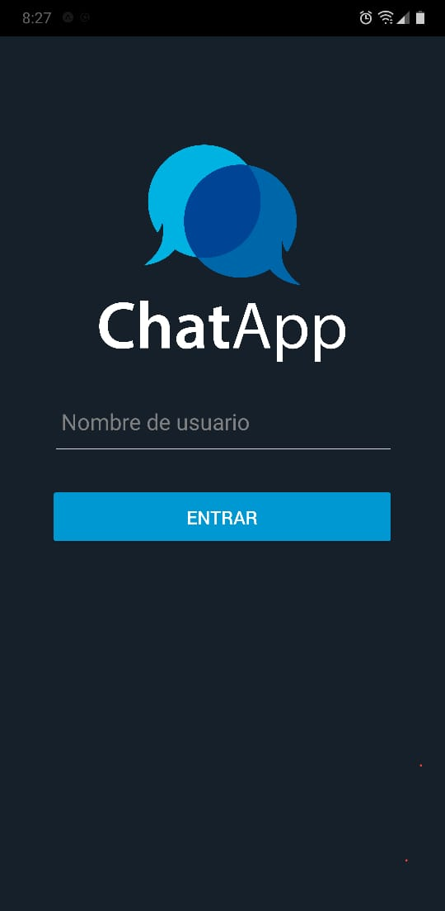
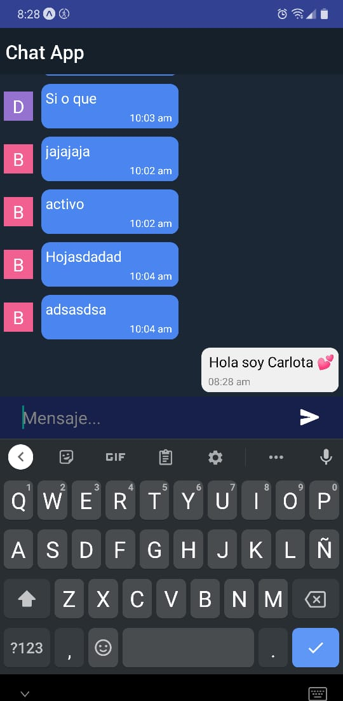
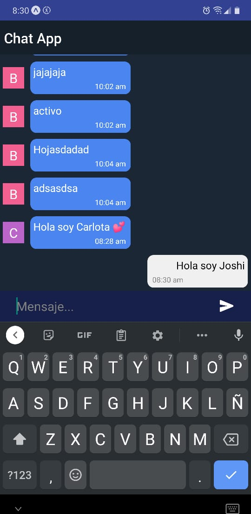

# App de chat en tiempo real!

### Este es un proyecto de ejemplo utilizando principios básicos de desarrollo móvil con expo y elementos de react-native
### Configuracion: 
  - DB: Firebase 
  - Styles: native-base

Snaps:

1. Home:

2. Message with User 1:

3. Message with User 1:

E.O
